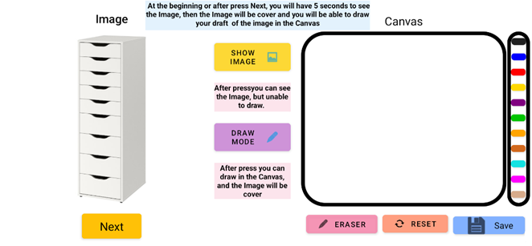
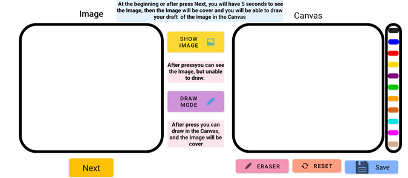
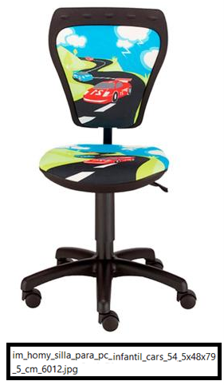
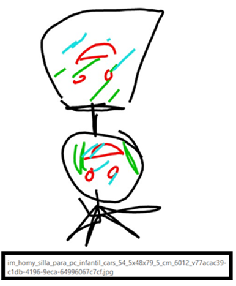

# Trace Draw 
**Luis Corvalán**

La aplicación “Trace Draw” fue desarrollada con el propósito de recolectar data sobre dibujos realizados en base a un determinado set de imágenes. Para realizar esto, se utilizó Android Studio. 

## Nivel de Usuario:

La aplicación consta de un mostrador de imágenes, un set de instrucciones, una pizarra, una barra de colores, una goma, botones para pasar de modo “Show Image” a “Draw Mode” y viceversa, botón para guardar el dibujo realizado, un botón para reiniciar la pizarra y otro para pasar a la siguiente imagen. Tal como se muestra a continuacion.

Al iniciar la app o presionar el botón “Next”, se dispondrá de 5 segundos para ver la imagen bajo “Image”, posteriormente, se ocultará y el usuario debe de intentar dibujar lo que vio en el rectángulo debajo de donde dice “Canvas”. En caso de que desease ver la imagen nuevamente, basta con presionar el botón “Show Image” y se mostrara la imagen, pero se inhabilitará la opción de dibujo hasta que se presione “Draw Mode”. Si se quiere cambiar el color, basta con presionar el color deseado de la barra de colores. Para borrar algo de la pizarra hay dos opciones, la primera es presionando “Eraser”, con la cual puedes borrar algunas líneas o trazos; la segunda opción es apretando “Reset”, con esta opción, se borrarán todas las líneas y trazos realizados sobre la pizarra. Una vez listo el dibujo se debe de presionar el botón “Save”, con lo cual se guardará en la galería del dispositivo el dibujo realizado, la cual posteriormente debe de ser enviada a la persona correspondiente, a través de algún medio comunicado con anticipación, por ejemplo, Gmail.

‼‼ **Es importante que al presionar “Save” se vea el dibujo y se encuentre en “Draw Mode”, esto debido a que, si no se hace, puede ocurrir que se guarde una imagen en blanco en vez del dibujo.**‼‼

## Nivel de Codigo:

La aplicación consta de archivos de muchos tipos, pero con los que principalmente uno trabaja son los  .java , .jpg , .xml . El código que permite funcionar la app, tal como seria que al presionar un botón ocurra una determinada acción, se encuentra en los .java, más específicamente en MainActivity.java y WhiteBoard.java . Lo que contiene WhiteBoard son las instrucciones y el funcionamiento de la pizarra de la aplicación, además de otros métodos internos, como limpiar la pizarra. Mientras que MainActivity posee todas las otras funciones e instrucciones, tales como cargar todas las imágenes de manera automática o de guardar el dibujo en la galería del dispositivo. Ambos archivos se encuentran en dentro de la carpeta imag en /[example](https://github.com/LuisCorv/Pre-practice/tree/branch/imag/app/src/main/java/com/example).

Si se desea modificar el set de imágenes de la aplicación, son necesario hacer 2 cosas, la primera es incorporar o extraer las imágenes deseadas a la carpeta drawable en /[res](https://github.com/LuisCorv/Pre-practice/tree/branch/imag/app/src/main/res), sin eliminar los archivos .xml presentes en drawable, ya que estos son los que definen el formato en que los usuarios interactúan con la app, siendo la mostrada en la imagen del nivel usuario el layout diseñado para el teléfono (activity_main.xml);

Y la segunda es construir otro APK desde Android estudio. Para realizar esto ingresa al siguiente [link](https://qr.ae/proyrl). Este APK que generaste es el que puedes compartir para que otros prueben o actualicen “Trace Draw” a la última versión que les enviaste. Pero a las personas que se los envien deben de ser de confianza, ya que, ya que si no es un "Signed APK" esas pueden ingresar al codigo de la app.

**Algunas otras cosas importantes de comentar son que:**
-	Las imágenes que se deseen utilizar en la app deben de haber tenido algún tratamiento previo, en este caso es hacer que no tenga caracteres o símbolos especiales (excepto el guion bajo), mayúsculas ni tildes o letras de otro abecedario que no sea el inglés y que no inicie con un valor numérico. Es decir, los únicos caracteres posibles de las imágenes son Alpha numéricos en minúsculas y el guion bajo, además de la extensión de la imagen [.jpg o .png]. 

-	Los dibujos guardados poseen un nombre especifico con el cual pueden ser identificados para su posterior organización y compilación, por lo que es importante que el medio por el cual los usuarios envíen sus dibujos al responsable no modifique el nombre original de los dibujos. Ya que, si esto ocurre, será imposible asociar los dibujos correctamente, por lo que se tendrían que descartar.

